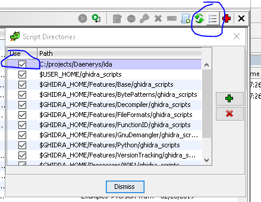
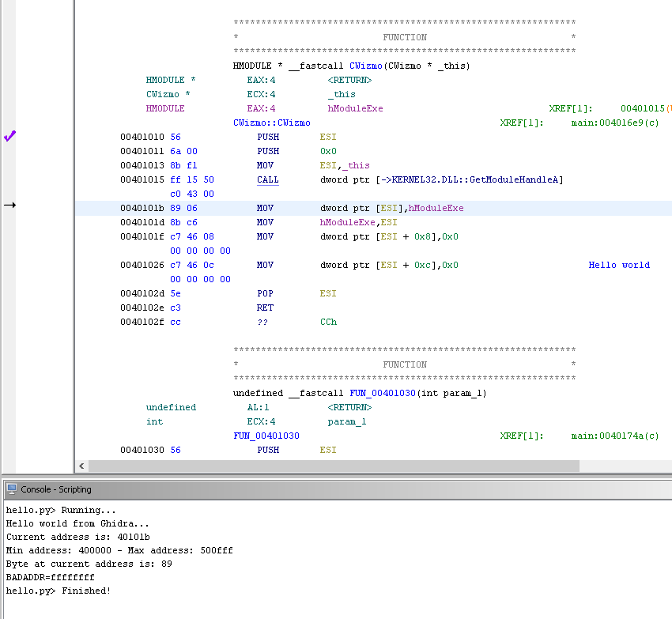

# Introduction

Daenerys is an interop framework that allows you to run IDAPython scripts under Ghidra and Ghidra scripts under IDA Pro with little to no modifications.


The project's logo symbolizes harmony between the two SRE frameworks.

# Installation

Just copy the IDA Pro Ghidra adapter scripts from the `IDA` folder in this repository to:

`C:\Users\[username]\.ghidra\.ghidra-9.0\dev\ghidra_scripts\bin` or wherever your Jython `sys.path` points to.

Alternatively, you can add the path to those scripts in the Scripts Manager window:


## Example script

```python
# Daenerys IDAPython example script

#@category Daenerys.IDAPython.Examples

import idc

print("Hello world from Ghidra...")
print("Current address is: %x" % idc.here())
print("Min address: %x - Max address: %x" % (idc.MinEA(), idc.MaxEA()))
print("Byte at current address is: %02x" % idc.Byte(idc.here()))
print("BADADDR=%x" % idc.BADADDR)
```



# Project state and future work

The Daenerys framework is still in its very early development stage. Both IDA and Ghidra have a rich API set (xrefs, instructions decoding/encoding, decompiler, UI, etc.) and it will take time to implement the adapters that let you achieve perfect interoperability between them.


* Implement IDAPython adapters for Ghidra: Run unmodified IDAPython scripts in Ghidra.
* Implement Ghidra adapters for IDAPython: Run unmodified Ghidra Python scripts in IDA Pro

Your contributions is welcome.